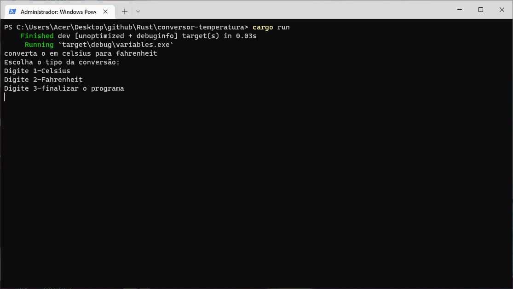
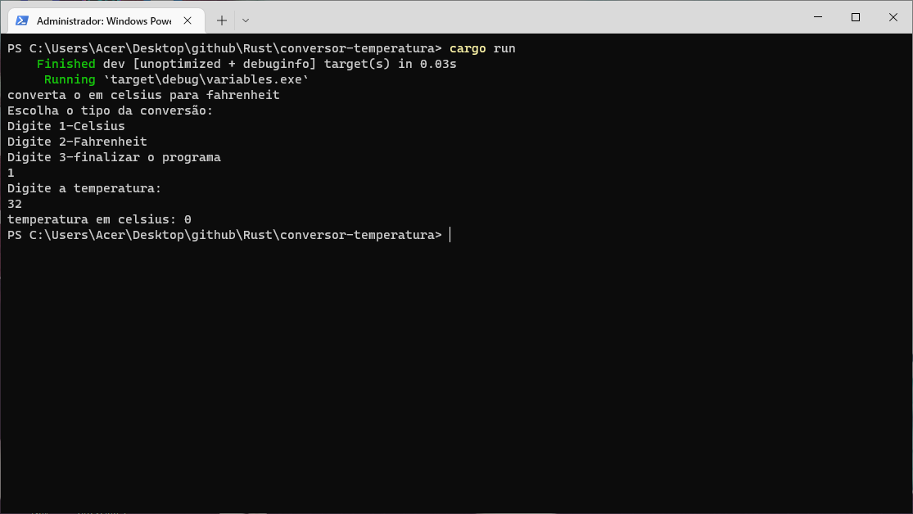

# Conversor de temperatura

conversor de temperatura em Rust, converte celsius em fahrenheit.

<!--ts-->
   * [Sobre](#Sobre)
   * [Tecnologia usada](#Tecnologia)
   * [Print da aplicação](#Aplicação)
<!--te-->

### Sobre
Uma calculadora simples para a conversão de temperatura, afim de produzir algo simples em uma nova limguagem.

### Pré-requisitos
Caso deseja rodar o programa é necessário o [rust](https://www.rust-lang.org/pt-BR) instalado, e caso deseja abrir o código para visualizar uma IDE de sua escolha.

### Tecnologia.
As seguintes tecnologias foram usada no projeto.
- [rust](https://www.rust-lang.org/pt-BR)

### Aplicação

### Autor
Feito por Bruno Pessoa

